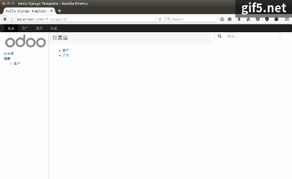

# 使用 React 和 Django 的 BS 应用范例

> 主要技术栈 React, Redux, Bootstrap, Django(Python)

## 如何运行

- 运行 `npm install` 准备环境 
- 运行 Webpack 实时编译 ES6 代码 `webpack --watch`
- 运行 Web 应用 `./manage.py runserver`
- 在浏览器中打开 [http://localhost:8000/firsrtapp] 

> 项目生成过程请参考[How To](howto.md)

## 前端使用的 npm 库
- "react": "^15.4.1",
- "react-addons-update": "^15.4.1",
- "react-dom": "^15.4.1",
- "react-redux": "^5.0.1",
- "react-router": "^3.0.0",
- "react-router-redux": "^4.0.7",
- "redux": "^3.6.0",
- "redux-thunk": "^2.1.0",
- "superagent": "^3.3.1"

> 前端使用 Bootstrap 3.x 来构建界面，使用flexbox 弹性布局

## 后端
- django 1.10.x
- django rest framework
